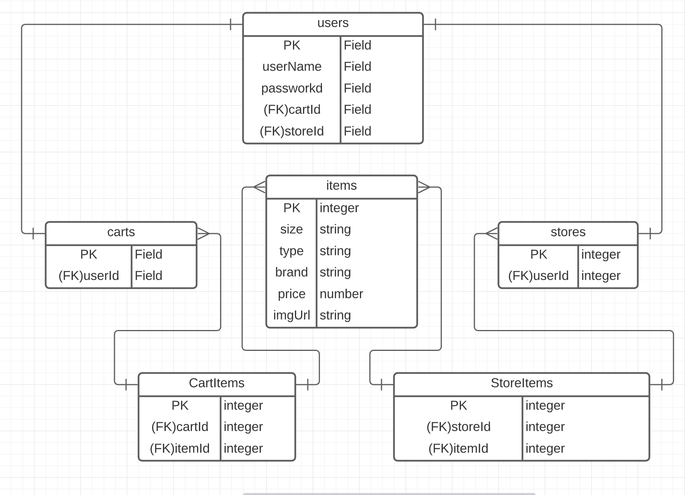

# Project 2 Pitch Guidelines
Project Description and Pitch Guidelines for SEIR SEA P2

---
## Project 2 Goals

In your second project you will create a full stack Express and Postgres app which has:
- *At least x2 models, and utilize and build at least one relationship between the two models.*
- *Sequelize as an ORM to interact with and create your database.*
- *An Express server utilizing EJS/EJS layouts for UI design and styling.*
- *Interaction with and inclusion of at least one API.*

## Project 2 Pitch Guidelines

In designing and building your project, you will start by forking and cloneing this repository, and then editing this README to include the following information: 
1. Name of your app
2. Tech stack you plan to use
     * Sequelize
     * Node - express, express layouts, ejs, axios
     * Javascript
     * Postgres - pg
3. Simple wireframes
     * Can be handdrawn, or with tool of your choice
     * Example online tool: [Miro.com](https://miro.com/)
5. API you plan to use
     * https://www.thecocktaildb.com/api.php
6. ERD
     
7. Example of how to call/invoke your API, and a description of what data comes back. 
     * Use axios within my controllers to make the API call (use string interpolation to add parameters to URL)
     * The JSON data that is returned for the cocktail by name includes drink id, drink name, type of glass, if it's alcoholic or non, instructions, ingredients, measurements, and a .jpg of the drink.
8. MVP goals (x3-5) 
     * Users can search for drinks by name or by ingredient
     * Once they have signed up, allow users to add/delete drinks to their list of favorites
     * Once they have signed up, allow users to add/delete drinks to a "want to try" list 
     * Start of styling
9. Stretch goals (x2-5)
     * Allow logged in users to rate their saved drinks
     * Allow logged in users to add/delete ingredients to a liquor cabinet list
     * Better styling
10. Any potential roadblocks?
     * I don't fully understand all of this yet 😅

## How to get started
1. **Fork and clone this repository.**
2. **Edit the text above to include specifics of your project.**
3. **Commit, push, and submit a pull request to this repo with your edited pitch README.**
4. *After you have met with a staff member and your pitch has been approved, suggested next steps:*
      * Write out your routes and create a RESTful routing chart.
      * Come up with a breakdown of what you plan to accomplish each day and how you are going to accomplish it.
      * Create a new git repo for your project. 
      * Make all test API calls you need to to ensure your API will be usable for this project. 
      

