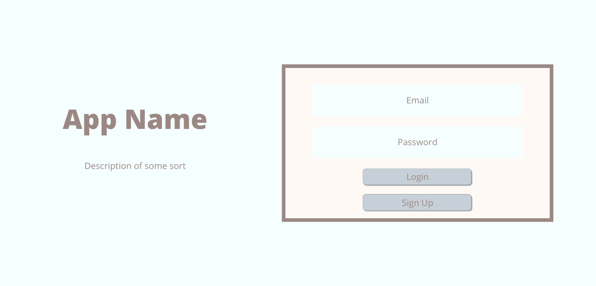
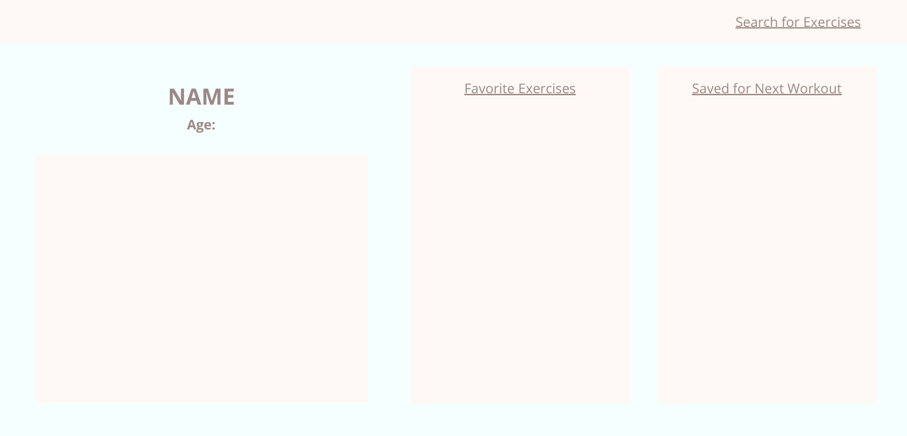
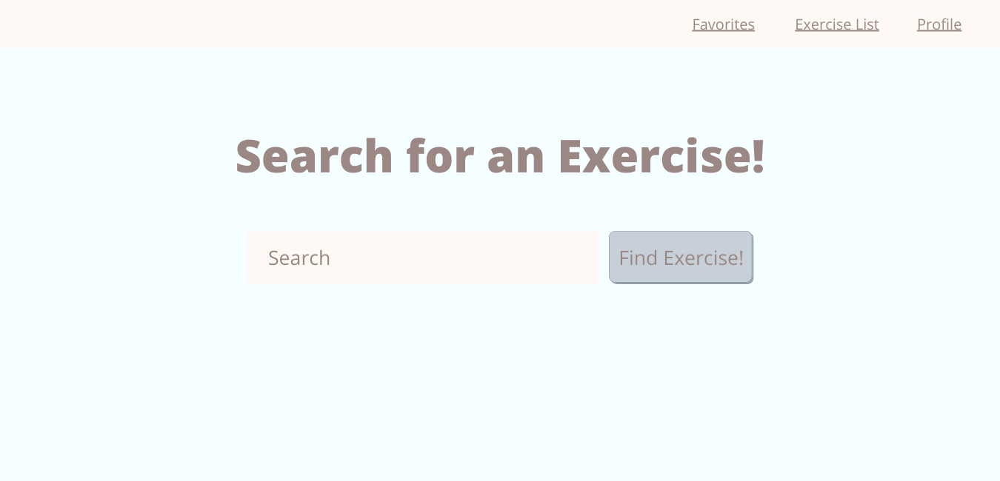
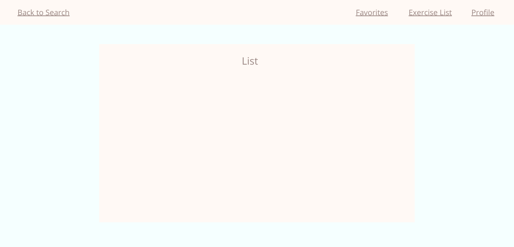
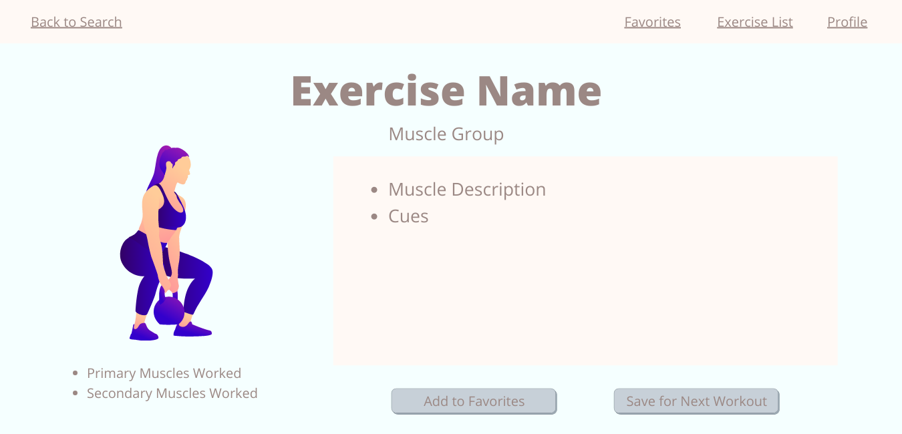

# Fitness App Name TBD

## Tech Stack
* Postgres
* Express
* Node.JS

---
## Wireframes
* Welcome Page

* User Profile

* Search

* Same Layout for Results, Favorites, & Saved Lists

* Detailed Exercise

---
## API
* wger Workout Manager

---
## ERD

---
## Examples of API Data
API root = https://wger.de/api/v2/<:param>/?language=2
* Exercise = exercise/
     1. Name = results.name
     2. Description = results.description
     3. Muscle group = results.category
     4. Primary muscle = results.muscles
     5. Secondary muscles = results.muscles_secondary
* Image = exerciseimage/
     1. Image = results.image
* Muscle Group = exercisecategory/
     1. id = results.id
     2. name = results.name
* Muscles = muscle/
     1. id = results.id
     2. name = results.name
* Cues = exercisecomment/
     1. id = results.id
     2. name = results.name
     3. cue = results.comment

---
## MVP
* Welcome page that renders login/sign up
* User profile page that displays basic user info, favorited exercises, and exercises user saved for next workout
* Detailed

---
## Stretch Goals
* Use a second API to call for inspirational fitness quotes
* Create a workout tracker for users
* Allow users to upload progress photos
* Styling

---
## Potential Roadblocks
* Some of the data returned might be in German
* Narrowing down what to search by