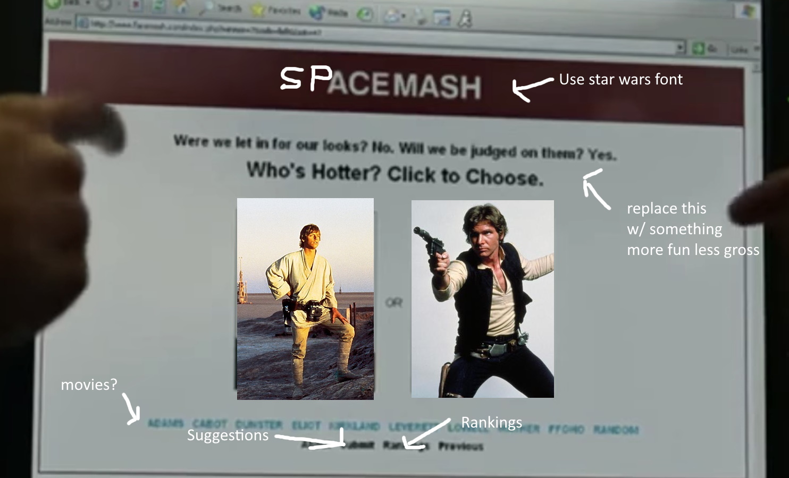

# Project 2 Pitch Guidelines
Project Description and Pitch Guidelines for SEIR SEA P2

---
## Project 2 Goals

In your second project you will create a full stack Express and Postgres app which has:
- *At least x2 models, and utilize and build at least one relationship between the two models.*
- *Sequelize as an ORM to interact with and create your database.*
- *An Express server utilizing EJS/EJS layouts for UI design and styling.*
- *Interaction with and inclusion of at least one API.*

## Project 2 Pitch Guidelines

In designing and building your project, you will start by forking and cloneing this repository, and then editing this README to include the following information: 
1. Name of your app
Space Mash
2. Tech stack you plan to use
Express, ejs layouts, sequelize, axios
3. Simple wireframes

5. API you plan to use
Mediawiki w\ Wookiepedia, Star Wars API
6. Example of how to call/invoke your API, and a description of what data comes back. 
GET https://starwars.fandom.com/api.php?action=parse&page=Luke_Skywalker&prop=images&format=json
Returns a json of the parsed page, including an array of the images on the page.
7. MVP goals (x3-5)
    - Display 2 random star wars characters.
    - Users can click on one to vote for it.
    - Ranking page displays the characters by rank
    - Suggestions page with a form for users to request unranked characters be added
8. Stretch goals (x2-5)
    - Get the larger list of characters from wookiepedia instead of SWAPI
    - rank characters using elo
    - add a details page with character info
    - submit page let you search for a valid character
    - show characters by movie
9. Any potential roadblocks?
    - Fandom.com wikis appear to use the Mediawiki api, but if they do anything different or unexpected, it's not documented.

## How to get started
1. **Fork and clone this repository.**
2. **Edit the text above to include specifics of your project.**
3. **Commit, push, and submit a pull request to this repo with your edited pitch README.**
4. *After you have met with a staff member and your pitch has been approved, suggested next steps:*
      * Write out your routes and create a RESTful routing chart (good example [here](https://gk-hynes.github.io/restful-routes-chart/)).
      * Come up with a breakdown of what you plan to accomplish each day and how you are going to accomplish it.
      * Create a new git repo for your project. 
      * Make all test API calls you need to to ensure your API will be usable for this project. 
      

