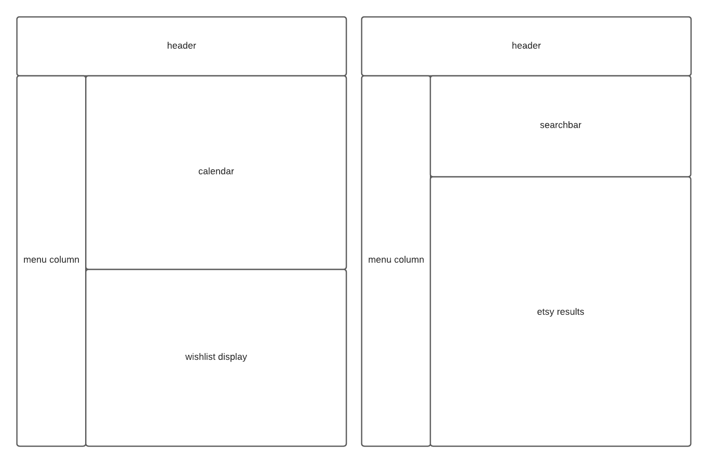
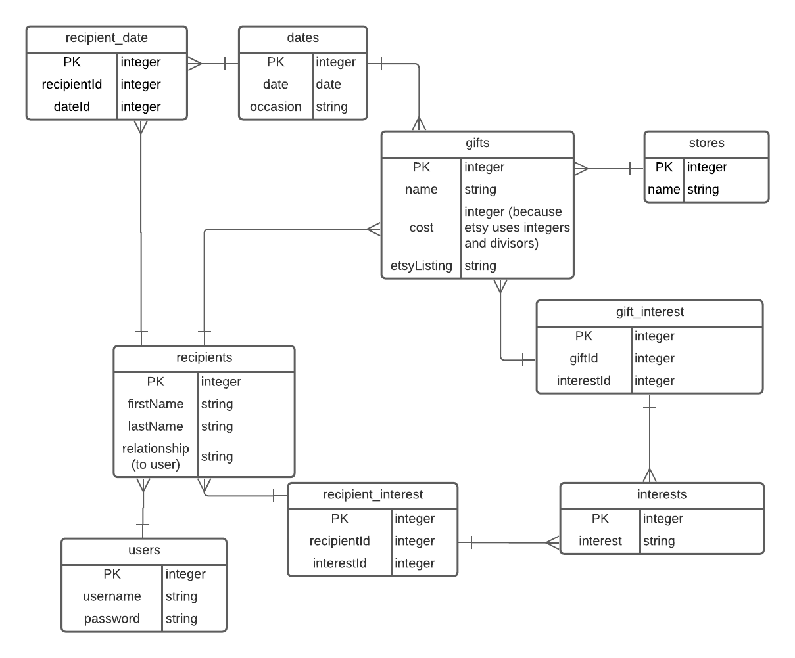

# Unnamed Holiday Shopping Planner
I'm not the best gift-giver, especiallhy when I am shopping for more than one person. This application will allow users to track who they are shopping for, what their interests are, and any potential gift ideas before they are ready to make purchases. This will replace the disastrous spreadsheets I use to plan gifts for my own family.

## Tech Stack
Front-end: HTML5, CSS (including flexbox and grid), JavaScript

Back-end: PostgreSQL, Sequelize, Express, Node.js, EJS


## User Stories
* As a shopper, I would like to have quick access to a list of those I would like to give gifts to, and a summary of their interests.
* I would like to create and save gift ideas for later comparison and reference.
* I would like to be able to reference upcoming gift-giving dates (holidays, birthdays, anniversaries).
* I would like to be able to access and save Etsy listings that are related to my recipients' interests.

## The Etsy API
The Etsy API allows robust access to listing information for sellers and buyers. This app will only making use of customer-side GETs. The API allows, among other things, searching for listings by keyword, securing seller information, prices, images, products descriptions, and product tags.

Here is a sample object, truncated for brevity. Note that images are retrieved in a separate query.

```JSON
{
"listing_id": 894818171,
"user_id": 26469072,
"shop_id": 8614061,
"title": "Custom Pet Christmas Ornament, Handmade Pet Illustration, Cat Dog Portrait, Ceramic Christmas Tree Decoration, Personalized Gift Photo Xmas",
"description": "↓↓IMPORTANT INSTRUCTIONS BELOW↓↓\n\n\nThese custom pet ornament portraits are the best gift for any animal lover! They are super adorable and will make the perfect addition to your Christmas tree.\n\nEach pet portrait is done by hand (I work with an amazing artist to help out with the many orders!), to order with the help of photos that you will send of your pet!,
"state": "active",
"creation_timestamp": 1636684765,
"ending_timestamp": 1647052765,
"original_creation_timestamp": 1603936721,
"last_modified_timestamp": 1636684765,
"state_timestamp": 1636401960,
"quantity": 968,
"shop_section_id": 33475871,
"featured_rank": 1,
"url": 'https://www.etsy.com/listing/894818171/custom-pet-christmas-ornament-handmade',
"num_favorers": 273,
"non_taxable": false,
"is_customizable": true,
"is_personalizable": true,
"personalization_is_required": true,
"personalization_char_count_max": 256,
"personalization_instructions": "Write the name of your pet(s) along with the accessory (optional) you&#39;d like for each pet. Refer to the listing photo of accessories and write the accessory number.",
"listing_type": 0,
"tags": [
"custom dog ornament",
"custom cat ornament",
"custom pet ornament",
"Cat Photo Gift",
"Pet Photo Gift",
],
"materials": [
"ceramic",
"gold ribbon"
],
"shipping_profile_id": 155630002256,
"processing_min": 1,
"processing_max": 8,
"who_made": "collective",
"when_made": "made_to_order",
"is_supply": false,
"item_weight": null,
"item_weight_unit": null,
"item_length": null,
"item_width": null,
"item_height": null,
"item_dimensions_unit": null,
"is_private": false,
"style": [],
"file_data": "",
"has_variations": true,
"should_auto_renew": true,
"language": "en-US",
"price": {
"amount": 3999,
"divisor": 100,
"currency_code": "USD"
},
"taxonomy_id": 1857,
"production_partners": []
}
```

## Wireframes

Modals will be used to add and edit gift recipients and holidays.

## ERD

The initial product may not include the stores table, in which case, the app will be restricted to products from Etsy.

## MVP Goals
1. A SQL database that stores app users, gift recipients, gifts, interests, important dates, and stores. 
1. A form for users to add recipients that they plan to shop for, their recipients' interests, and the occasions for which they are shopping.
1. Integration with the Etsy API to allow searching for products, and saving products for later reference.
1. Auto suggestions based on the interests provided by the user, executed by Etsy API query.

## Stretch Goals
1. The ability to add non-Etsy products manually.
1. A calendar/upcoming events that displays all upcoming birthdays, events, etc., and a reminder to purchases gifts if you have not already.
1. Cleaner design using modals.
1. Optimization for mobile.

## Potential Roadblocks
* Presenting a great deal of information in a visually clear manner. Will investigate accessible color-coding, symbols, etc.
* Database could potentially include more columns in each table--paring down will be necessary.

