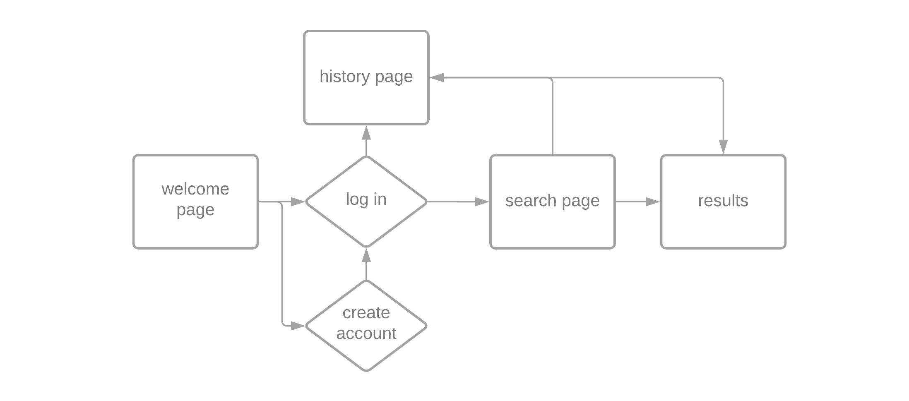

# Project 2 Pitch Guidelines
Project Description and Pitch Guidelines for SEIR SEA P2

---
## Project 2 Goals

In your second project you will create a full stack Express and Postgres app which has:
- *At least x2 models, and utilize and build at least one relationship between the two models.*
- *Sequelize as an ORM to interact with and create your database.*
- *An Express server utilizing EJS/EJS layouts for UI design and styling.*
- *Interaction with and inclusion of at least one API.*

## Project 2 Pitch Guidelines

In designing and building your project, you will start by forking and cloneing this repository, and then editing this README to include the following information: 
1. Name of your app

**Music Time Machine**

2. Tech stack you plan to use

**Postgres, Express**

3. Simple wireframes

**Wireframes:**
     <p text-align="center">
     
     </p>

5. API you plan to use

**Spotify Web API (client credentials flow)**

6. ERD

     <p text-align="center">
     
     </p>

7. Example of how to call/invoke your API, and a description of what data comes back. 

**The Spotify Web API uses REST principles to return JSON metadata from the Spotify Data Catalogue. The app.js file that is included in this folder (make sure to run npm install for node dependecies) uses the client credentials flow to produce a response that includes album information, given a Spotify album ID number. The client credentials flow does not ask the site user for their Spotify information; it only authenticates the request via the developer(client) credentials.**
```sh
{
  album_type: 'album',
  artists: [
    {
      external_urls: [Object],
      href: 'https://api.spotify.com/v1/artists/0TnOYISbd1XYRBk9myaseg',
      id: '0TnOYISbd1XYRBk9myaseg',
      name: 'Pitbull',
      type: 'artist',
      uri: 'spotify:artist:0TnOYISbd1XYRBk9myaseg'
    }
  ],
  available_markets: [
    'AD', 'AE', 'AL', 'AM', 'AO', 'AT', 'AZ', 'BA', 'BE', 'BF',
    'BG', 'BH', 'BI', 'BJ', 'BW', 'BY', 'CH', 'CI', 'CM', 'CV',
    'CY', 'CZ', 'DE', 'DJ', 'DZ', 'EE', 'EG', 'ES', 'FI', 'FR',
    'GA', 'GB', 'GE', 'GH', 'GM', 'GN', 'GQ', 'GR', 'GW', 'HR',
    'HU', 'IE', 'IL', 'IT', 'JO', 'KE', 'KG', 'KM', 'KW', 'KZ',
    'LB', 'LI', 'LR', 'LS', 'LT', 'LU', 'LV', 'MA', 'MC', 'MD',
    'ME', 'MG', 'MK', 'ML', 'MN', 'MR', 'MT', 'MU', 'MW', 'MX',
    'MZ', 'NA', 'NE', 'NG', 'NL', 'NO', 'OM', 'PL', 'PS', 'PT',
    'QA', 'RO', 'RS', 'RU', 'RW', 'SA', 'SC', 'SE', 'SI', 'SK',
    'SL', 'SM', 'SN', 'ST', 'SZ', 'TD', 'TG', 'TN', 'TR', 'TZ',
    ... 7 more items
  ],
  copyrights: [
    {
      text: '(P) 2012 RCA Records, a division of Sony Music Entertainment',
      type: 'P'
    }
  ],
  external_ids: { upc: '886443671584' },
  external_urls: { spotify: 'https://open.spotify.com/album/4aawyAB9vmqN3uQ7FjRGTy' },
  genres: [],
  href: 'https://api.spotify.com/v1/albums/4aawyAB9vmqN3uQ7FjRGTy',
  id: '4aawyAB9vmqN3uQ7FjRGTy',
  images: [
    {
      height: 640,
      url: 'https://i.scdn.co/image/ab67616d0000b2732c5b24ecfa39523a75c993c4',
      width: 640
    },
    {
      height: 300,
      url: 'https://i.scdn.co/image/ab67616d00001e022c5b24ecfa39523a75c993c4',
      width: 300
    },
    {
      height: 64,
      url: 'https://i.scdn.co/image/ab67616d000048512c5b24ecfa39523a75c993c4',
      width: 64
    }
  ],
  label: 'Mr.305/Polo Grounds Music/RCA Records',
  name: 'Global Warming',
  popularity: 59,
  release_date: '2012-11-16',
  release_date_precision: 'day',
  total_tracks: 18,
  tracks: {
    href: 'https://api.spotify.com/v1/albums/4aawyAB9vmqN3uQ7FjRGTy/tracks?offset=0&limit=50',
    items: [
      [Object], [Object], [Object],
      [Object], [Object], [Object],
      [Object], [Object], [Object],
      [Object], [Object], [Object],
      [Object], [Object], [Object],
      [Object], [Object], [Object]
    ],
    limit: 50,
    next: null,
    offset: 0,
    previous: null,
    total: 18
  },
  type: 'album',
  uri: 'spotify:album:4aawyAB9vmqN3uQ7FjRGTy'
}
```

8. MVP goals (x3-5)

**- create user database for storing user login data**
**- set up user form to successfully call Spotify Web API to GET albums from a selected genre for a certain year**
**- create one-to-many relationship between 1 user and many result inputs**
**- save user result inputs to results database, and make a page to display the user's past searches**

9. Stretch goals (x2-5)

**- create ejs page that includes additional information about each album, besides just album name and release year**
**- explore including a "play" link or option (not sure how this works within the API, so I need to do more research)**

10. Any potential roadblocks?

**- I need to make sure I am adhering to the Spotify development/design guidelines for this app (very detailed and specific requirements for using their API)**
**- I need to fully understand the differences/limitations of different authorization flows, mainly client credentials vs. authorization code flow**

## How to get started
1. **Fork and clone this repository.**
2. **Edit the text above to include specifics of your project.**
3. **Commit, push, and submit a pull request to this repo with your edited pitch README.**
4. *After you have met with a staff member and your pitch has been approved, suggested next steps:*
      * Write out your routes and create a RESTful routing chart.
      * Come up with a breakdown of what you plan to accomplish each day and how you are going to accomplish it.
      * Create a new git repo for your project. 
      * Make all test API calls you need to to ensure your API will be usable for this project. 
      