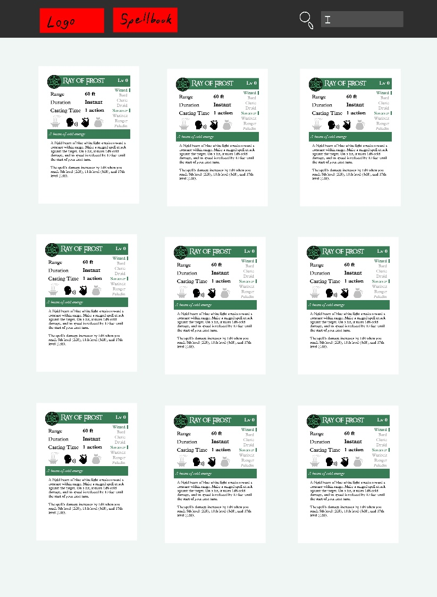

# Project 2 Pitch Guidelines
Project Description and Pitch Guidelines for SEIR SEA P2

---
## Project 2 Goals

In your second project you will create a full stack Express and Postgres app which has:
- *At least x2 models, and utilize and build at least one relationship between the two models.*
- *Sequelize as an ORM to interact with and create your database.*
- *An Express server utilizing EJS/EJS layouts for UI design and styling.*
- *Interaction with and inclusion of at least one API.*

## Project 2 Pitch Guidelines

In designing and building your project, you will start by forking and cloneing this repository, and then editing this README to include the following information: 
1. Name of your app
    * Spellbook
2. Tech stack you plan to use
    * Postgresql
    * Express
    * Node.js
    * Boostrap
3. Simple wireframes
     * 
5. API you plan to use
    * http://www.dnd5eapi.co/
6. Example of how to call/invoke your API, and a description of what data comes back.
    * https://www.dnd5eapi.co/api/spells/  -- Lists all Spells
    * https://www.dnd5eapi.co/api/spells/acid-arrow/ -- Lists details about the spell
7. MVP goals (x3-5)
    [] Make login page for users to have individual "spellbooks"
    [] Allow users to browse list of spells and add them to a "spellbook"
    [] Allow users to "homebrew" their own spells by being able to modify their saved spell's name/description/damage dice/material costs/etc.
8. Stretch goals (x2-5)
    [] Instead of a list of spells in the spellbooks, use Bootstrap to do flip card animations
    [] Use Bootstrap Modals to allow for "homebrewing" of spells
    [] Add list of classes who can use the spells
9. Any potential roadblocks?
    * Keeping a user "signed in" while they traverse each page.

## How to get started
1. **Fork and clone this repository.**
2. **Edit the text above to include specifics of your project.**
3. **Commit, push, and submit a pull request to this repo with your edited pitch README.**
4. *After you have met with a staff member and your pitch has been approved, suggested next steps:*
      * Write out your routes and create a RESTful routing chart (good example [here](https://gk-hynes.github.io/restful-routes-chart/)).
      * Come up with a breakdown of what you plan to accomplish each day and how you are going to accomplish it.
      * Create a new git repo for your project. 
      * Make all test API calls you need to to ensure your API will be usable for this project. 
      

