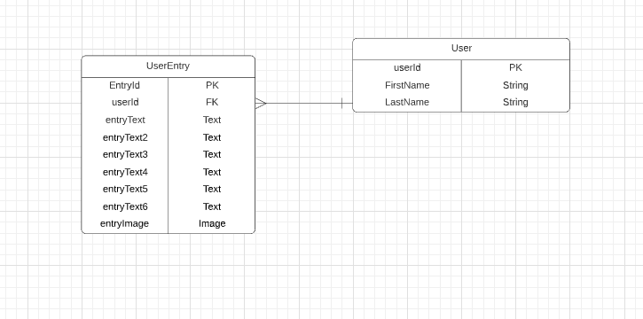

# Project 2 Pitch Guidelines

Project Description and Pitch Guidelines for SEIR SEA P2

---

## Project 2 Goals

In your second project you will create a full stack Express and Postgres app which has:

- _At least x2 models, and utilize and build at least one relationship between the two models._
- _Sequelize as an ORM to interact with and create your database._
- _An Express server utilizing EJS/EJS layouts for UI design and styling._
- _Interaction with and inclusion of at least one API._

## Project 2 Pitch Guidelines

1. My Chronicles
2. Tech Stack
   - React
   - Node
   - Express
   - SASS
3. Famous Quotes API
4. MVP goals:
   - Login User
   - Be able to retrieve all entries from user
   - Be able to retrieve one entry from user
   - Be able to add images
   - Change grid layout
5. Stretch goals:
   - Set up a timeline
   - Make app for mobile use
   - Allow the user to select weather and feeling from emojis.
6. Any potential roadblocks?

## How to get started

1. **Fork and clone this repository.**
2. **Edit the text above to include specifics of your project.**
3. **Commit, push, and submit a pull request to this repo with your edited pitch README.**
4. _After you have met with a staff member and your pitch has been approved, suggested next steps:_
   - Write out your routes and create a RESTful routing chart.
   - Come up with a breakdown of what you plan to accomplish each day and how you are going to accomplish it.
   - Create a new git repo for your project.
   - Make all test API calls you need to to ensure your API will be usable for this project.
