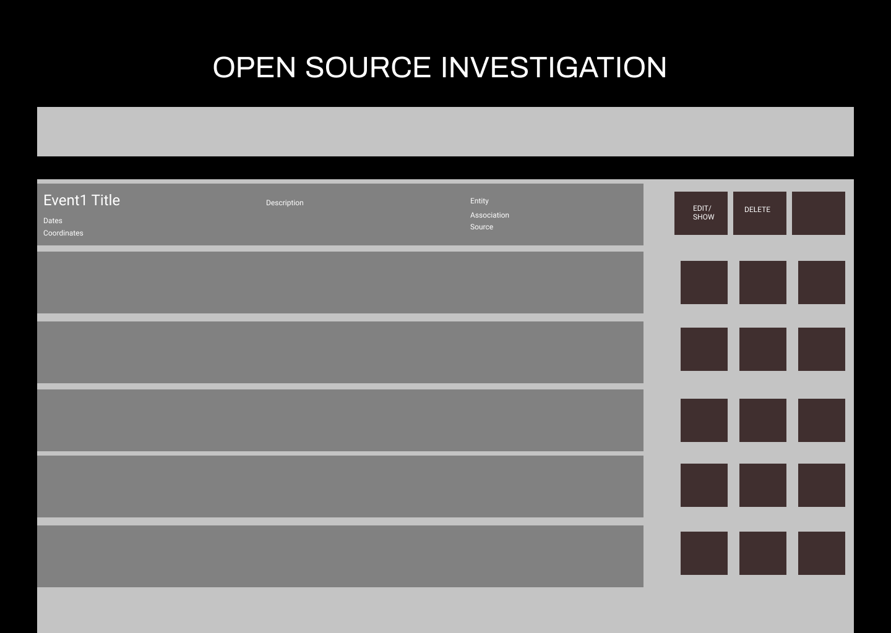

# time-map-clone-prototype
An implementation of the the timemap software developed by FA but in the PEN stack.

This timemap software allows you to keep track of the location and places of events and the entities that are associated with them. FA has used this to do dataviz/data analysis and find patterns in event/location data to track certain human rights abuses. This sort of dashboarding is common in Open Source Intelligence circles.

I would like the timemap to be as open to the user as possible, i.e. it could also be used to track a missing cat. It could also be used to track where you had certain thoughts during the day and so forth.


## Tech Stack
- Postgres 
- Express.js
- Node.js
- Mapbox API
- Axios
- Sequelize
- react-svg-timeline (would help mitigate the pains of doing this in CSS)
- d3js for stretch goal forced directed graph? Would require more "relations". Stetch Goal.


## Wireframes
---





## ERD STRUCTURE
---


API utilized:
mapbox for interactive point detection/display?
I would use the APIS ability to get point information and use that coordination information into my database along with other possible points of interest?
I would also use the APIS ability to dispaly information on the map in order to create markers and popups.


## API EXAMPLES:


### GETTING MOUSE COORDINATES:


```javascript
mapboxgl.accessToken = 'pk.eyJ1IjoiZHJ5dXRzdW4iLCJhIjoiY2t2dTc1cDQxM21laTJwcWd6bHE3NXk0aSJ9.0_oLKZMzGfSgG7UxPJvf_w';
const map = new mapboxgl.Map({
container: 'map', // container id
style: 'mapbox://styles/mapbox/streets-v11',
center: [-74.5, 40], // starting position
zoom: 9 // starting zoom
});
map.on('mousemove', (e) => {
document.getElementById('info').innerHTML =
// `e.point` is the x, y coordinates of the `mousemove` event
// relative to the top-left corner of the map.
JSON.stringify(e.point) +
'<br />' +
// `e.lngLat` is the longitude, latitude geographical position of the event.
JSON.stringify(e.lngLat.wrap());
});
```

This will return geo-coordinates from the mapbox object.

### GETTING POPUP MODALS:

```javascript
const markerHeight = 50;
const markerRadius = 10;
const linearOffset = 25;
const popupOffsets = {
'top': [0, 0],
'top-left': [0, 0],
'top-right': [0, 0],
'bottom': [0, -markerHeight],
'bottom-left': [linearOffset, (markerHeight - markerRadius + linearOffset) * -1],
'bottom-right': [-linearOffset, (markerHeight - markerRadius + linearOffset) * -1],
'left': [markerRadius, (markerHeight - markerRadius) * -1],
'right': [-markerRadius, (markerHeight - markerRadius) * -1]
};
const popup = new mapboxgl.Popup({offset: popupOffsets, className: 'my-class'})
.setLngLat(e.lngLat)
```

This will create popup modals on the mapbox object.


### ADDING POPUPS TO MAP
```javascript
new mapboxgl.Popup()
.setLngLat([0, 0])
.setHTML("<h1>Null Island</h1>")
.addTo(map);
```

This will add popups to the map.


## SPRINT GOALS:

- [x] 2021-11-11: At this point I would like to have my wireframes, ERD, Sprint Goals, MVP and Stretch goals all mapped out.
- [ ] 2021-11-12: At this point I would like to have my models and relationships created, I want to seed dummy data, and start/complete stubbing out my controllers/routes and views.
- [ ] 2021-11-13: At this point I want to start working with the mapbox api in order to get coordinate data and interactivity completed. 
- [ ] 2021-11-14: At this point I want to extend the views to display more pertinent data, i.e. timeline, modals.
- [ ] 2021-11-15: At this point, I would like to have interactivity functionality completed.
- [ ] 2021-11-16:
- [ ] 2021-11-17:
- [ ] 2021-11-18:
- [ ] 2021-11-19:

## MVP:
- [ ] I would like to have my models and route stubs created. Forms should display the correct information.
- [ ]  I would like the map to display the "event" on the map.
- [ ]  I would like some rudimentary time-related slider / timeline functionality.
- [ ]  Ideally, I would like for the user to be able to click on the screen and get lat-lon data for data entry. This should be put into the form.

## STRETCH GOALS
- Possible translation of relational data into graph schema to render a force directed graph into canvas (to show the node to line relationship between events and entities? No fancy stuff, just want to see if it is possible. Will not require external API call.
- Adding more complex forms of relationships, i.e. "items" that connect people over time and space...perhaps open entiteis up to many to many relationships.
- Impeccable design.

## OBSTACLES
- Unforseen errors in the data schema. Might I actually need a many to many relationship, have I built the linking table to achieve this?
- I have to figure out if I want the page to reload or the map to reload. What kind of program structure would I need so I don't get caught in some sort of "route" contradiction, where a map refreshes with new data, but the page itself has not changed? Perhaps I should look back to the games projects that we have done.
- Need to research what exactly is included in the "DOM" in this particular instance?


## USER STORIES / ROUTE PLANNING

- As a user, I would like to be able to see all my current projects.
- As a user, If I click on a particular project, I should be directed to an individualized project page.
    - This project page should have a form to enter in new  data.
    - When I submit new data, It should refresh the page and/or the map with the new information I submitted.
- As a user, If I click on a the map, I should have coordinates autoloaded into my submission form. If possible, I would like a temporary marker to be placed in that location.

- When I interact with the map, when I click on a certain marker, It should display some sort of popup that has limited information about the event. Ideally it would be the details most pertinent to me.
    - If that is not possible, it should send me to the individualized "event" page for that that datapoint.


