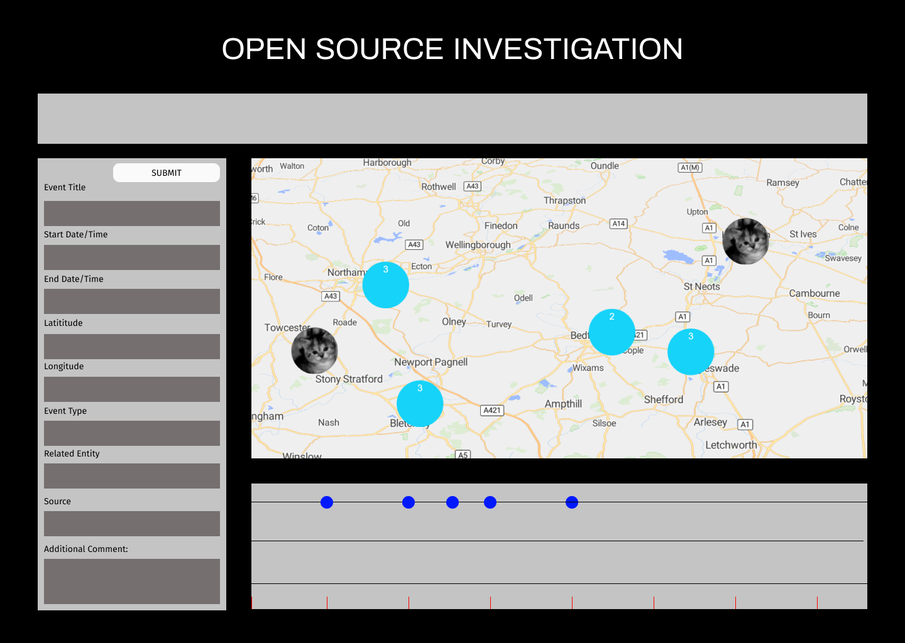

# time-map-clone-prototype
An implementation of the the timemap software developed by FA but in the PEN stack


## Tech Stack
- Postgres 
- Express.js
- Node.js
- Mapbox API
- Axios
- Sequelize
- react-svg-timeline (would help mitigate the pains of doing this in CSS)
- d3js


## Wireframes
---



## ERD STRUCTURE
---


API utilized:
mapbox for interactive point detection/display?
I would ingest the APIS ability to get point information and ingest that information into my database along with other information.
I would also use the APIS ability to dispaly information


## API EXAMPLE:


### GETTING MOUSE COORDINATES:


```javascript
mapboxgl.accessToken = 'pk.eyJ1IjoiZHJ5dXRzdW4iLCJhIjoiY2t2dTc1cDQxM21laTJwcWd6bHE3NXk0aSJ9.0_oLKZMzGfSgG7UxPJvf_w';
const map = new mapboxgl.Map({
container: 'map', // container id
style: 'mapbox://styles/mapbox/streets-v11',
center: [-74.5, 40], // starting position
zoom: 9 // starting zoom
});
map.on('mousemove', (e) => {
document.getElementById('info').innerHTML =
// `e.point` is the x, y coordinates of the `mousemove` event
// relative to the top-left corner of the map.
JSON.stringify(e.point) +
'<br />' +
// `e.lngLat` is the longitude, latitude geographical position of the event.
JSON.stringify(e.lngLat.wrap());
});
```

This will return geo-coordinates from the mapbox object.

### GETTING POPUP MODALS:

```javascript
const markerHeight = 50;
const markerRadius = 10;
const linearOffset = 25;
const popupOffsets = {
'top': [0, 0],
'top-left': [0, 0],
'top-right': [0, 0],
'bottom': [0, -markerHeight],
'bottom-left': [linearOffset, (markerHeight - markerRadius + linearOffset) * -1],
'bottom-right': [-linearOffset, (markerHeight - markerRadius + linearOffset) * -1],
'left': [markerRadius, (markerHeight - markerRadius) * -1],
'right': [-markerRadius, (markerHeight - markerRadius) * -1]
};
const popup = new mapboxgl.Popup({offset: popupOffsets, className: 'my-class'})
.setLngLat(e.lngLat)
```

This will create popup modals on the mapbox object.


### ADDING POPUPS TO MAP
```javascript
new mapboxgl.Popup()
.setLngLat([0, 0])
.setHTML("<h1>Null Island</h1>")
.addTo(map);
```

This will add popups to the map.


## SPRINT GOALS:

- [x] 2021-11-11: At this point I would like to have my wireframes, ERD, Sprint Goals, MVP and Stretch goals all mapped out.
- [ ] 2021-11-12: At this point I would like to have my models and relationships created, I want to seed dummy data, and start/complete stubbing out my controllers/routes and views.
- [ ] 2021-11-13: At this point I want to start working with the mapbox api in order to get coordinate data and interactivity completed. 
- [ ] 2021-11-14: At this point I want to extend the views to display more pertinent data, i.e. timeline, modals.
- [ ] 2021-11-15: At this point, I would like to have interactivity functionality completed.
- [ ] 2021-11-16:
- [ ] 2021-11-17:
- [ ] 2021-11-18:
- [ ] 2021-11-19:


## MVP:
- [ ]  I would like to have my models and route stubs created. Forms should display the correct information. Each view should fulfill the user story for navigation.
- [ ]  I would like the map to display the "event" on the map. This events should have popup modals and be represented by a certain icon.
- [ ]  I would like some rudimentary time-related slider / timeline functionality in order to see locations over time...
- [ ]  Ideally, I would like for the user to be able to click on the screen and get lat-lon data for data entry. This should be put into the form.
- [ ]  Users should be able to perform full CRUD operations in their respective views.
- [ ]  I would like it to be pretty and portfolio ready.


## STRETCH GOALS
- Possible translation of relational data into graph schema to render a force directed graph into canvas (to show the node to line relationship between events and entities? No fancy stuff, just want to see if it is possible. Will not require external API call.


## OBSTACLES
- Unforseen errors in the data schema. Might I actually need a many to many relationship, have I built the linking table to achieve this?


## ROUTE ARCHITECTURE / USER STORIES


User flow hasn't been fully sketched up but this is what I'm thinking so far.

### SITE NAVIGATION
- Main Index Page will be an index of all user projects
- If user clicks on a particular project they should be directed to an individual project page
	- This project page should have a form to enter in new data, it should display a map
	- When the user submits, it should refresh the page and display the new information. From a UX perspective, there should probably be some sort of toggle to determine whether or not data fields should be clickable.
- If the user clicks on a certain pre-existing marker, it should display some sort of modal data relating to the "title" "association" "entityid" "sourcedata" and "comments" OR - If the user clicks on a certain maker, It should send the user to the page of that particular datapoint (individual view)

### TIMELINE NAVIGATION
- I would like users to click on the timeline and get the corresponding marker/popup information.
- The popups/markers should only appear at certain time makers, and should only display on the map if the user specifies that time marker via clicking.


